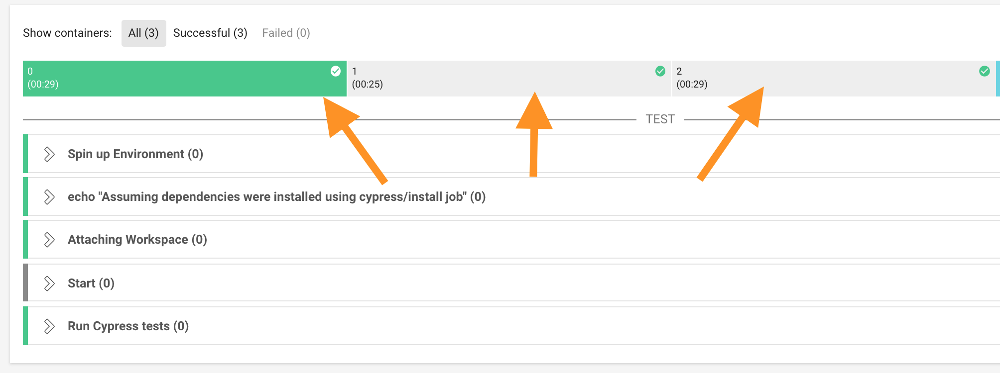
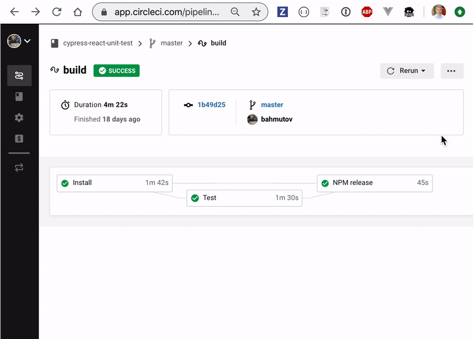

# Cypress CircleCI Orb [](https://circleci.com/gh/cypress-io/circleci-orb) [](https://circleci.com/orbs/registry/orb/cypress-io/cypress) [![renovate-app badge][renovate-badge]][renovate-app] [](https://github.com/cypress-io/circleci-orb/blob/master/LICENSE.md)

The Cypress CircleCI Orb is a piece of configuration set in your `circle.yml` file to correctly install, cache and run [Cypress.io](https://www.cypress.io) tests on CircleCI with very little effort. See this orb in [CircleCI Registry](https://circleci.com/orbs/registry/orb/cypress-io/cypress).

## Contents

- [How to enable orbs](#how-to-enable)
- [Lots of examples](#examples)
  - [simple](#simple)
  - [with recording on Dashboard](#record-on-dashboard)
  - [with parallel tests](#parallel)
  - [other examples](#other-examples)
- [Recipes](./docs/recipes.md)
  - [Install, test and release](./docs/recipes.md#install-test-and-release)
  - [Install, then run two different test jobs](./docs/recipes.md#install-and-run-two-test-jobs)
  - [Custom test command](./docs/recipes.md#custom-test-command)
  - [other recipes](./docs/recipes.md) like multiple jobs, testing on Windows, etc.
- [Naming](#naming)
- [Jobs and executors in this orb](#jobs-and-executors)
- [Orb versions](#versions)
- [Effective config](#effective-config)
- [Development and license](#development)

## How to enable

**Note ⚠️:** To use CircleCI Orbs in your projects, you need to enable two settings:

- From organization settings allow using uncertified orbs `Settings -> Security -> Allow uncertified orbs`
- From the project's settings allow beta features `Settings -> Advanced Settings -> Enable pipelines`

See the official [CircleCI documentation](https://circleci.com/docs/2.0/using-orbs/).

## Examples

Each example below should be placed into `circle.yml` or `.circleci/config.yml` file:

### simple

Install dependencies (using `npm ci`) and run all Cypress tests:

```yaml
# to use orbs, must use version >= 2.1
version: 2.1
orbs:
  # import Cypress orb by specifying an exact version x.y.z
  # or the latest version 1.x.x using "@1" syntax
  cypress: cypress-io/cypress@1
workflows:
  build:
    jobs:
      # "cypress" is the name of the imported orb
      # "run" is the name of the job defined in Cypress orb
      - cypress/run
```

See [cypress-io/circleci-orb-example](https://github.com/cypress-io/circleci-orb-example) [](https://circleci.com/gh/cypress-io/circleci-orb-example/tree/master)

### record on Dashboard

Runs all Cypress tests and records them on the Cypress Dashboard:

```yaml
version: 2.1
orbs:
  cypress: cypress-io/cypress@1
workflows:
  build:
    jobs:
      - cypress/run:
          record: true
```

### parallel

A more complex project that needs to install dependencies, build an application and run tests across 4 CI machines [in parallel](https://on.cypress.io/parallelization) may have:

```yaml
version: 2.1
orbs:
  cypress: cypress-io/cypress@1
workflows:
  build:
    jobs:
      # first get the source code and install npm dependencies
      - cypress/install:
          # run a custom app build step
          build: 'npm run build'
      - cypress/run:
          # make sure app has been installed and built
          # before running tests across multiple machines
          # this avoids installing same dependencies 10 times
          requires:
            - cypress/install
          record: true # record results on Cypress Dashboard
          parallel: true # split all specs across machines
          parallelism: 4 # use 4 CircleCI machines to finish quickly
          group: 'all tests' # name this group "all tests" on the dashboard
          start: 'npm start' # start server before running tests
```

In all cases, you are using `run` and `install` job definitions that Cypress provides inside the orb. Using the orb brings simplicity and static checks of parameters to CircleCI configuration.

### other examples

- [install dependencies using Yarn](docs/examples.md#yarn)
- [running tests using Node 14](docs/examples.md#using-node14)
- [running tests using Chrome browser](docs/examples.md#chrome)
- [start server before running tests](docs/examples.md#start-server)
- [wait for server to respond before starting tests](docs/examples.md#wait-for-server-to-respond)
- [parallel run across two machines](docs/examples.md#parallel-on-2-machines)
- [build application after install](docs/examples.md#build-app)
- [running several groups of tests](docs/examples.md#groups)
- [running another job after tests](docs/examples.md#release)
- [building using orb on Mac and Linux](docs/examples.md#linux-and-mac)
- [use custom executor](docs/examples.md#custom-executor)
- [set additional environment variables](docs/examples.md#env-vars)
- [install private NPM dependencies](docs/examples.md#install-private-npm-modules)
- [print info](docs/examples.md#print-info) after install
- [install extra tools](docs/examples.md#install-extra-tool)
- [complete NPM module publishing example](docs/examples.md#private-npm-module)
- [store test reports on Circle](docs/examples.md#store-test-reports)
- [store screenshots and videos on Circle](docs/examples.md#artifacts)
- [store other folders as artifacts on Circle](docs/examples.md#any-artifacts)
- [use your own custom command to run tests](docs/examples.md#custom-command)
- [skip saving workspace](docs/examples.md#no-workspace)
- [run commands in a subfolder of a monorepo](docs/examples.md#custom-directory)
- [cache using custom key in a monorepo](docs/examples.md#custom-cache-and-directory)
- [config](docs/examples.md#config)
- [custom configuration file](docs/examples.md#config-file)
- [tag recorded run](docs/examples.md#tags)
- [run different tests depending on the branch](docs/examples.md#run-on-master-branch)
- [turn on specific DEBUG logs](docs/examples.md#debug)
- [use custom `ci-build-id`](docs/examples.md#custom-build-id)

All examples are in [docs/examples.md](docs/examples.md) and are generated from the [src/orb.yml](src/orb.yml) file.

Also take a look at [cypress-io/cypress-example-circleci-orb](https://github.com/cypress-io/cypress-example-circleci-orb) and [cypress-io/cypress-example-kitchensink](https://github.com/cypress-io/cypress-example-kitchensink/pull/148/files). You can find more examples under GitHub topic [cypress-orb-example](https://github.com/topics/cypress-orb-example).

## Naming

When importing this orb, we suggest using local name "cypress" for consistency.

```yaml
version: 2.1
orbs:
  #          ↱ official orb name in the registry (org + name)
  cypress: cypress-io/cypress@1
  #  ↳ your local name for the imported orb
workflows:
  build:
    jobs:
      #   ↱ local orb name
      - cypress/run
      #          ↳ job "run" defined in the orb
```

You can of course use another local name

```yaml
version: 2.1
orbs:
  #             ↱ official orb name in the registry (org + name)
  e2eCypress: cypress-io/cypress@1
  #  ↳ your local name for the imported orb
workflows:
  build:
    jobs:
      #   ↱ local orb name
      - e2eCypress/run
      #             ↳ job "run" defined in the orb
```

We suggest importing the orb under the local name `cypress` and giving names to each job using the `name` parameter.

```yaml
version: 2.1
orbs:
  #          ↱ official orb name in the registry (org + name)
  cypress: cypress-io/cypress@1
  #  ↳ your local name for the imported orb
workflows:
  build:
    jobs:
      - cypress/run:
          name: E2E tests
```

See [Recipes](./docs/recipes.md) for more examples.

## Jobs and executors

See [docs/jobs.md](docs/jobs.md) and [docs/executors.md](docs/executors.md) for a full list of public jobs and executors that this orb provides. For example, if you want to execute tests using Node 14

```yaml
version: 2.1
orbs:
  cypress: cypress-io/cypress@1
workflows:
  build:
    jobs:
      - cypress/run:
          executor: cypress/base-14
```

For more examples, search for `executor` in the [docs/examples.md](docs/examples.md) page.

The CircleCI Orb exports the following job definitions to be used by the user projects:

### `run`

This job allows you to run Cypress tests on a one or more machines, record screenshots and videos, use the custom Docker image, etc.

A typical example:

```yaml
# to use orbs, must use version >= 2.1
version: 2.1
orbs:
  # import Cypress orb by specifying an exact version x.y.z
  # or the latest version 1.x.x
  cypress: cypress-io/cypress@1
workflows:
  build:
    jobs:
      # checks out code, installs npm dependencies
      # and runs all Cypress tests and records results on Cypress Dashboard
      # cypress/run job comes from "cypress" orb imported above
      - cypress/run:
          record: true
```

See all its parameters at the [cypress/run job example](docs/jobs.md#run).

### `install`

⚠️ Warning: this job is only necessary if you plan to execute the `run` job later. If you only want to run all tests on a single machine, then you do not need a separate `install` job.

Sometimes you need to install the project's npm dependencies and build the application _once_ before running tests, especially if you run the tests on multiple machines in parallel. For example:

```yaml
version: 2.1
orbs:
  cypress: cypress-io/cypress@1
workflows:
  build:
    jobs:
      # install dependencies first (on 1 machine)
      - cypress/install
      # now run tests
      - cypress/run:
          # give this job a custom name for clarity
          name: 'end-to-end tests'
          requires:
            # use previously installed dependencies
            # to avoid installing them on each machine running tests
            - cypress/install
          record: true # record results to Cypress Dashboard
          parallel: true # run tests in parallel
          parallelism: 3 # use 3 CircleCI machines
          group: 3 machines # name this group "3 machines"
```

See available parameters at the [cypress/install job example](docs/jobs.md#install).

To better understand why we use a separate `install` job, take a look at the workflow diagram below.


The first job `install` runs on a single machine, and usually is very fast because it uses previously cached npm modules and Cypress binary to avoid reinstalling them. The second job `run` can run on multiple machines (in this case it runs on 3 machines), and uses workspace created by the `install` job to get 3 identical file systems before running tests. You can see the 3 parallel runs by clicking on the `run` job.



## Versions

Cypress orb is _versioned_ so you can be sure that the configuration will _not_ suddenly change as we change orb commands. We follow semantic versioning to make sure you can upgrade project configuration to minor and patch versions without breaking changes. See [CircleCI Orb versioning documentation](https://circleci.com/docs/2.0/creating-orbs/#semantic-versioning-in-orbs).

You can find all changes and published orb versions for Cypress orb at [cypress-io/circleci-orb/releases](https://github.com/cypress-io/circleci-orb/releases).

We are using `cypress-io/cypress@1` version in our examples, so you get the latest published orb version 1.x.x. But we recommend locking it down to an exact version to prevent unexpected changes from suddenly breaking your builds.

## Effective config

CircleCI expands orbs in your config file before running the workflows. You can see this _effective_ config in their UI



If you install [Circle local CLI][local-cli], you can see the final _effective_ configuration your project resolves to by running `circleci config process <config filename>` from the terminal.

For example, if your current CircleCI configuration file is `.circleci/config.yml` and it contains the following:

```yaml
version: 2.1
orbs:
  cypress: cypress-io/cypress@1
workflows:
  build:
    jobs:
      - cypress/run
```

The fully resolved configuration will show:

```shell
$ circleci config process .circleci/config.yml
# Orb 'cypress-io/cypress@1' resolved to 'cypress-io/cypress@1.1.0'
version: 2
jobs:
  cypress/run:
    docker:
    - image: cypress/base:12.14.0
    parallelism: 1
    steps:
    - checkout
    - restore_cache:
        keys:
        - cache-{{ .Branch }}-{{ checksum "package.json" }}
    - run:
        name: Npm CI
        command: npm ci
    - run:
        command: npx cypress verify
    - save_cache:
        key: cache-{{ .Branch }}-{{ checksum "package.json" }}
        paths:
        - ~/.npm
        - ~/.cache
    - persist_to_workspace:
        root: ~/
        paths:
        - project
        - .cache/Cypress
    - attach_workspace:
        at: ~/
    - run:
        name: Run Cypress tests
        command: 'npx cypress run'
workflows:
  build:
    jobs:
    - cypress/run
  version: 2
```

### Ejecting

If you want to customize the orb configuration, you can save and tweak the output of the `circleci config process ...` to suit your needs.

⚠️ Warning: there is no automated way to go from the "ejected" configuration back to using the orb.

## Development

If you want to develop this orb and publish new versions, see our [Contributing Guide](CONTRIBUTING.md).

## License

This project is licensed under the terms of the [MIT license](/LICENSE.md).

[renovate-badge]: https://img.shields.io/badge/renovate-app-blue.svg
[renovate-app]: https://renovateapp.com/
[local-cli]: https://circleci.com/docs/2.0/local-cli/
